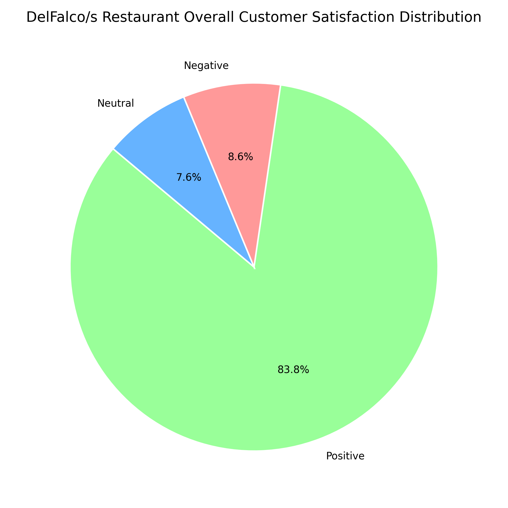
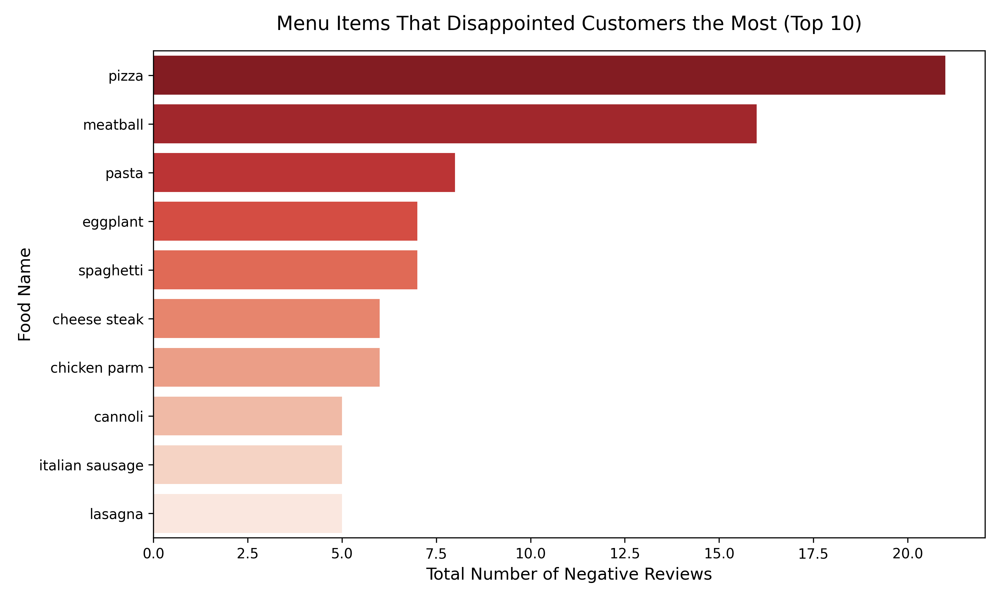

# 🍝 DelFalco's Yelp Reviews Analysis (NLP)

An end-to-end Natural Language Processing (NLP) and Sentiment Analysis project designed to extract actionable business insights from unstructured Yelp customer reviews for **DelFalco's Italian Restaurant**. By filtering textual data and applying custom text-mining pipelines, this project maps customer satisfaction directly to specific menu items to drive data-backed decisions for menu engineering.

---

## 📌 Project Overview
In the modern hospitality and retail industry, customer reviews contain critical clues about operational performance, but parsing thousands of text inputs manually is highly inefficient. This project builds a text-mining architecture that automates the analysis of restaurant reviews. Beyond general sentiment classification, the pipeline isolates exactly which specific dishes are praised and which ones receive recurring negative feedback or "disappointment markers," transforming unstructured text into direct business intelligence.

---

## 📊 Dataset Specifications
* **Dataset Format:** `restaurant.json` (Structured Yelp reviews schema).
* **Core Information:** Review texts, user ratings (`stars`), unique business tokens, and temporal tracking parameters.
* **Analytical Target:** Segmenting unstructured text into positive/negative sentiment zones and capturing dish-specific customer evaluation metrics.

---

## 🛠️ Technology Stack & Dependencies
* **Programming Language:** Python
* **Text Processing (NLP):** NLTK (Natural Language Toolkit), RegEx (Regular Expressions)
* **Data Wrangling:** Pandas, NumPy
* **Data Visualization:** Matplotlib, Seaborn, WordCloud

---

## 🚀 NLP & Text Mining Pipeline

### 1. Text Preprocessing & Cleaning
* Converted all textual inputs to lowercase patterns to maintain computational uniformity.
* Stripped punctuation, numerical noises, and structural HTML artifacts using Regular Expressions.
* Filtered out linguistic noise by dropping standardized English `Stopwords` (e.g., "the", "is", "at").
* Applied Lemmatization/Stemming to reduce word variants to their canonical base forms.

### 2. Sentiment Analytics & Metric Extraction
* Categorized review layers into localized sentiment blocks utilizing polarity indicators.
* Cross-analyzed text structures against structural user star ratings to establish analytical baselines.

### 3. Target Menu Item Analysis (Menu Engineering)
* Compiled a structured vocabulary vector of key Italian menu components (e.g., specific pasta types, sauces, sides).
* Built a text-matching function to calculate specific mention frequencies and isolate dishes tied closely to negative feedback or operational friction points.

---

## 📈 Visual Insights & Analytics

### 1. Customer Sentiment Breakdown
The vast majority of customer comments contain highly favorable feedback, confirming solid baseline brand satisfaction across historical review records.



### 2. Keyword Density (WordCloud)
A custom-generated WordCloud highlights that terms like **"delicious", "good", "sauce", "sandwich", and "place"** occupy massive operational focus within the community discourse.


### 3. Operational Friction Points (Disappointment Mapping)
By filtering phrases containing explicit critical notes, the script isolates exactly which menu offerings require immediate quality control or recipe adjustment.



---

## 📁 Repository Structure
```text
├── data/
│   └── restaurant.json
├── visual_assets/
│   ├── delfalcos_wordcloud.jpg
│   ├── disappointment_bar_chart.png
│   └── restaurant_general_pie_chart.png
├── DelFalco's Yelp Reviews Analysis (NLP).ipynb
└── README.md
